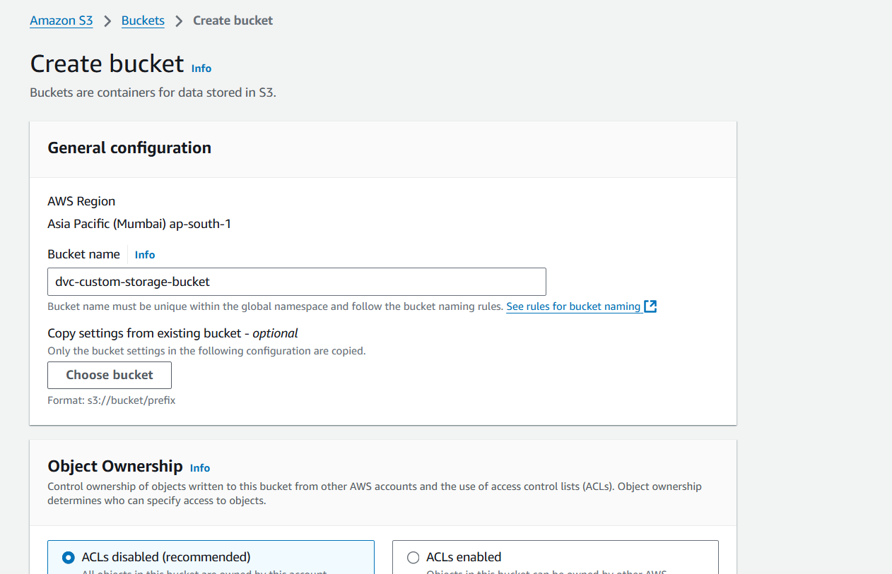

### Using Service Account Method with DVC in GitHub CI/CD Pipeline

**Content**

1. [Setup AWS S3 bucket storage](#setup-aws-s3-bucket-storage)
2. [Local Setup](#local-setup)
3. [Github Repo setup](#github-repo-setup)
4. [Github Actions](#github-actions)


### Setup GC bucket storage

Note: We can create roles or policies and proceed for specific permission I didnt explore it.

- Go to "I AM" dashboard and click the user that has account level permission

    

- Make sure it has "AdministratorAccess" perimission

    

- Click "Create Access Key" -> "Application running outside AWS" -> "Create access key" -> Download .csv file

  

- if you look at .csv file `Access key ID` and `Secret access key`

Important: Store the API key in a local folder and do not commit it to GitHub.

In AWS console select "mumbai"(ap-south-1) region and search "S3"

Click "Create bucket" and give a unique bucket name and keep all other settings as default. When you click "Create bucket" again it may throw error sometime if the bucket name is already taken by some one. 

  

- You can create a new folder named "storage"

- s3 url would be `s3://dvc-custom-storage-bucket/storage/`

  


### Local Setup

Hereafter, in your local setup, we need to setup envirnoment variables for `AWS_ACCESS_KEY_ID` and `AWS_SECRET_ACCESS_KEY`

- Do following things

```
  export AWS_ACCESS_KEY_ID='myid'
  export AWS_SECRET_ACCESS_KEY='mysecret'
```
so example would be (please generate your own credentials and bucket url)

```
  export AWS_ACCESS_KEY_ID='AKIA5S3JKX7B'
  export AWS_SECRET_ACCESS_KEY='jmwdRngXTaqpamwlwkjKQYTZN+gAHn8b'
```

- Create a folder named data locally.

- Copy the contents from this Kaggle dataset (https://www.kaggle.com/datasets/khushikhushikhushi/dog-breed-image-dataset) into the data folder and unzip it. Remove all files that are not needed (e.g., archive.zip is not needed after unzipping).

**Tree example**
```
  |- data
  |----dataset
  |--------Beagle
  |--------Boxer
  |-------- etc folders
  |-------- etc folders
```
- Install dvc and dvc-gs

```pip install dvc dvc-s3```

- Run git init (if you are not in a git folder already)

- Run dvc init

- Now run `dvc remote add -d myremote s3://<bucket>/<key> command`. Reference [here](https://dvc.org/doc/user-guide/data-management/remote-storage/amazon-s3)

eg:  ```dvc remote add -d myremote s3://dvc-custom-storage-bucket/storage/````

You will see that "myremote" has been added in the .dvc file.


- Run ```dvc add data```  i.e `dvc add <data_folder_name>

- Run ```dvc config core.autostage true``` (optional)

- Run ```dvc push -r myremote -v```

- Wait for about 10 minutes if it's around 800 MB of data for pushing; if it's in GitHub Actions, wait for 15 minutes.

Now you can check your AWS S3 bucket; you should see a folder named "files" like this:


### Github Repo setup

- Now push this to your GitHub repository. Note that in the .dvc folder, by default, you can only push the "config" and ".gitignore" files. Don't change this; let it remain as is.

- Important: Never push the secrets file. If you do, AWS might identify it and revoke the token; you'll need to set the key again.

- Add only .dvc/config, .gitignore, and data.dvc files.

- After pushing to repo, in github in your repo click on "Secrets and variables" -> "Actions" -> "Repository secret" in your GitHub repo and create following secrets


### Github Actions

- Create a .github/workflows folder locally for setting up your GitHub Actions workflow.

- You can refer to the `dvc-aws-s3-integration.yml` file for complete content. 

Below is the code used to set up authentication and pull data inside GitHub CI/CD from AWS S3:


```
      - name: DVC Pull Data
        env:
          AWS_ACCESS_KEY_ID: ${{ secrets.AWS_ACCESS_KEY_ID }}
          AWS_SECRET_ACCESS_KEY: ${{ secrets.AWS_SECRET_ACCESS_KEY }}
          AWS_DEFAULT_REGION: ${{ secrets.AWS_REGION }}
        run: |
          dvc pull -r myremote -v
```

- Now you can trigger workflow by clicking "Run workflow" in github actions


- You might see an error like this but its not a problem wait for sometime it is internally downloading files


- After 5 minutes(Depending on the data size) you can see successfull run


**Reference**

- Refered [amazon-s3-and-compatible-servers](https://dvc.org/doc/user-guide/data-management/remote-storage/amazon-s3#amazon-s3-and-compatible-servers)
- Environment variables from [here](https://dvc.org/doc/user-guide/data-management/remote-storage/amazon-s3#environment-variables) 

